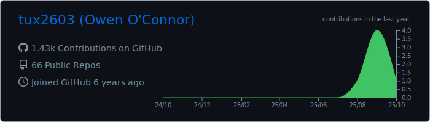

# tux2603

PhD student and graduate research assistant at Tennessee Technological University. My current interests are HPC and low level hardware design and optimization, which I'm combining for my research. We are currently researching options to greatly increase the power efficiency of large scale data processing in embedded systems, with the end goal of delivering HPC-level performance in a mobile power budget.

## Languages and Technologies

![python icon] ![cplusplus icon] ![c icon] ![java icon] ![js icon]

![linux icon] ![vscode icon] ![git icon] ![bash icon] ![google icon]

![aws icon] ![docker icon] ![github icon] ![jupyter icon] ![rpi icon]

-----------------------------------

 
 

[python icon]: https://raw.githubusercontent.com/tux2603/tux2603/master/icons/python-original.svg "python"
[cplusplus icon]: https://raw.githubusercontent.com/tux2603/tux2603/master/icons/cplusplus-original.svg "c++"
[c icon]: https://raw.githubusercontent.com/tux2603/tux2603/master/icons/c-original.svg "c"
[java icon]: https://raw.githubusercontent.com/tux2603/tux2603/master/icons/java-original.svg "java"
[js icon]: https://raw.githubusercontent.com/tux2603/tux2603/master/icons/javascript-original.svg "javascript"
[linux icon]: https://raw.githubusercontent.com/tux2603/tux2603/master/icons/linux-original.svg "linux"
[vscode icon]: https://raw.githubusercontent.com/tux2603/tux2603/master/icons/vscode-original.svg "vscode"
[git icon]: https://raw.githubusercontent.com/tux2603/tux2603/master/icons/git-original.svg "git"
[bash icon]: https://raw.githubusercontent.com/tux2603/tux2603/master/icons/bash-original.svg "bash"
[google icon]: https://raw.githubusercontent.com/tux2603/tux2603/master/icons/google-original.svg "google"
[aws icon]: https://raw.githubusercontent.com/tux2603/tux2603/master/icons/amazonwebservices-original.svg "aws"
[docker icon]: https://raw.githubusercontent.com/tux2603/tux2603/master/icons/docker-original.svg "docker"
[github icon]: https://raw.githubusercontent.com/tux2603/tux2603/master/icons/github-original.svg "github"
[jupyter icon]: https://raw.githubusercontent.com/tux2603/tux2603/master/icons/jupyter-original.svg "jupyter"
[rpi icon]: https://raw.githubusercontent.com/tux2603/tux2603/master/icons/raspberrypi-original.svg "raspberry pi"
